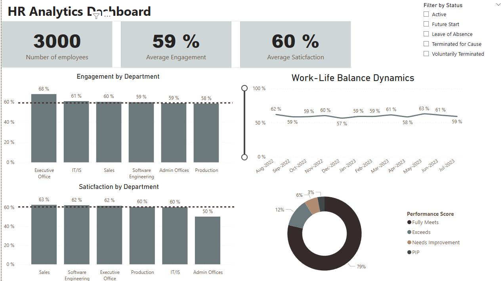

# HR Analytics Dashboard 📊

## 📌 Project Overview
This Power BI dashboard provides a comprehensive analysis of employee data to help the HR department monitor key performance indicators (KPIs) and understand employee attrition patterns. 

## 🛠 Tech Stack & Skills
*   **Power BI:** Data visualization and report orchestration.

## 💡 Key Insights & Business Impact
*   **Attrition Analysis:** Identified a [X]% attrition rate, with the highest turnover in the [Sales/Tech] department.
*   **Work-Life Balance:** Discovered a direct correlation between high overtime hours and employee turnover.

## 📸 Dashboard Preview
> **Note:** Since GitHub cannot render .pbix files, please see the preview below.

---
## 📂 How to View
1. Download the `HR-analisys-Rymar.pbix` file.
2. Open it using **Power BI Desktop**.
